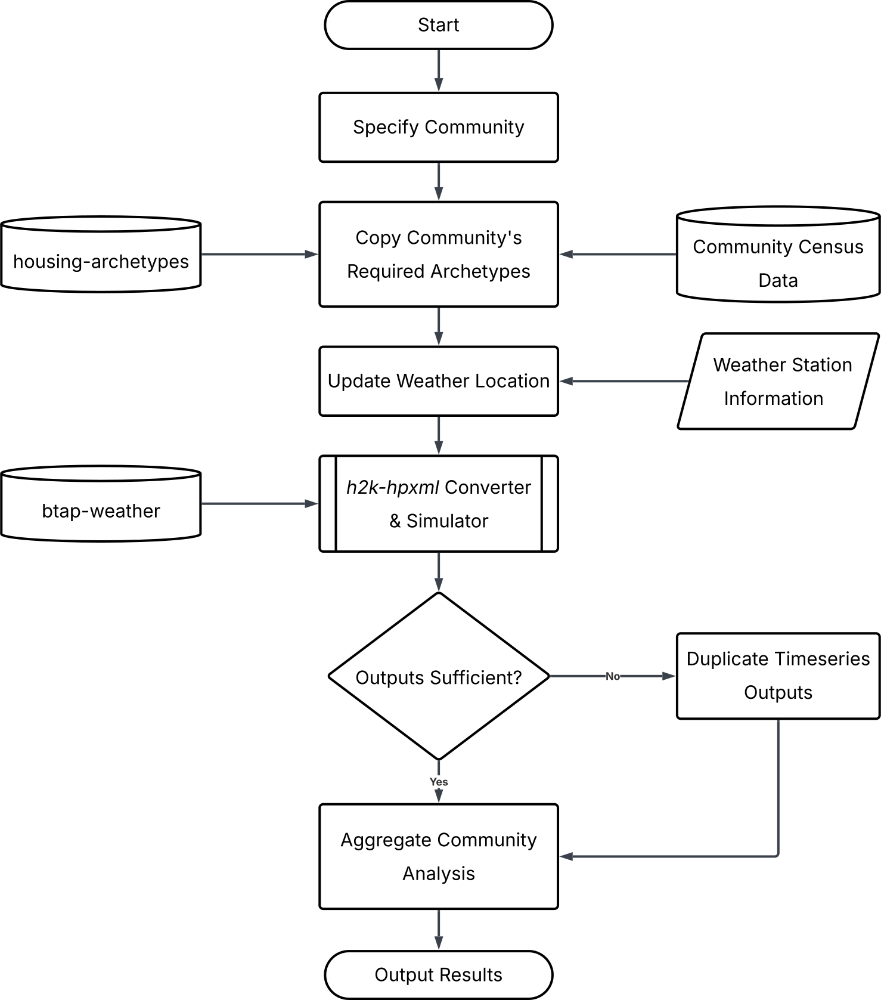

# Background

## What Is the Community Energy Orchestrator?

The Community Energy Orchestrator is a tool that generates **hourly heating energy demand profiles** for the residential building stock in Canada's northern and remote communities. It takes a community name as input, selects representative building models, runs physics-based energy simulations, and produces hourly timeseries data showing how much energy each home type consumes over a full year — broken down by fuel type.

While annual heating energy estimates for these communities have been available through previous work, the orchestrator provides the temporal resolution needed to assess **peak heating demand**, evaluate **thermal storage requirements**, and plan **renewable energy systems and community microgrids**.

## Why Does This Exist?

Nearly 100,000 Canadians live in 139 permanent communities across Canada's north that have no access to the electrical grid or piped natural gas. These communities rely primarily on diesel fuel and/or heavy fuel oil for space heating and electricity generation, often delivered in bulk at semi-annual intervals due to remoteness and seasonal accessibility.

Annual heating energy estimates are useful for long-term energy accounting, but they do not capture the strong seasonal and diurnal variability that governs heating energy needs in cold climates. Without hourly data, it is not possible to:

- Assess peak heating demand to size heating systems and backup generation
- Evaluate diurnal and seasonal thermal storage requirements
- Determine the operational feasibility of non-dispatchable renewable energy sources
- Design community microgrid architectures

This tool fills that gap by producing hourly heating demand profiles for all 139 communities, providing the temporal detail needed for energy transition planning.

## How It Works

The orchestrator runs a multi-step workflow for a given community:

### 1. Look Up Community Requirements

Each community has a profile in `data/json/communities.json` that defines its housing stock and climate data. The housing stock was characterized using Canada's Census of Population — the number of each dwelling type (single detached, semi-detached, row house) and their approximate construction vintage were estimated from inter-census dwelling count differences. For communities where only population data was available, dwelling counts were extrapolated using a regression model trained on communities with complete data.

Each community profile includes:

- **Housing requirements** — how many of each building type and vintage exist (e.g., 110 pre-2002 single detached, 30 pre-2002 semi-detached)
- **Weather location** — the nearest HOT2000 weather station (used to assign climate data for simulation)
- **Province/territory** and **heating degree days (HDD)**

### 2. Copy Housing Archetypes

The tool selects representative Hot2000 (`.H2K`) building models from a local archetype library (`data/source-archetypes/`). These archetypes come from the [housing-archetypes](https://github.com/canmet-energy/housing-archetypes) dataset — a collection of 2,271 real home energy models. Each model captures detailed home characteristics including geometry, insulation, windows, doors, and mechanical systems.

The archetypes are organized by construction era and building type:

| Era | Building Types |
|-----|---------------|
| Pre-2002 | Single detached, Semi-detached, Row middle, Row end |
| 2002–2016 | Single detached, Semi-detached, Row middle, Row end |
| Post-2016 | Single detached, Semi-detached, Row middle, Row end |

The number of files copied for each type matches the community's housing requirements (plus 20% extra to account for simulation failures). When a community requires more homes of a given type than exist in the archetype library, models are duplicated at random to fill the gap.

### 3. Update Weather Location

Each copied `.H2K` file is modified so its weather reference points to the community's assigned weather station from the HOT2000 Climate Map. This is what makes the simulation climate-specific — heating loads depend directly on local weather data. When these modified files are later passed through the conversion toolchain, the embedded weather metadata is used to select the appropriate Canadian Weather Year for Energy Calculation (CWEC 2020) file for EnergyPlus simulation.

### 4. Convert and Simulate

The `.H2K` files are passed through an HPXML-based conversion toolchain:

1. [h2k-hpxml](https://github.com/canmet-energy/h2k-hpxml) converts H2K files to the standardized HPXML format
2. [openstudio-hpxml](https://github.com/NatLabRockies/OpenStudio-HPXML) converts HPXML to EnergyPlus Input Data Files (IDF)
3. EnergyPlus runs the hourly simulation, producing a timeseries CSV for each dwelling

Each simulation produces 8,760 hourly rows (one full year) of energy consumption broken down by fuel type (electricity, natural gas, propane, oil, wood).

This step is the most computationally intensive and runs in parallel across available CPU cores.

### 5. Aggregate Results

Individual building results are combined into community-level totals. If any simulations failed, the tool duplicates existing results to reach the required count for each building type, ensuring the community total reflects the correct housing mix.

The final outputs include hourly community-wide energy demand by fuel type, peak day analysis, and summary statistics.

## Key Concepts

- **Archetype** — A representative Hot2000 building model (`.H2K` file) for a specific era and building type. The archetype library contains 2,271 real home models from northern Canadian communities, gathered through the EnerGuide Rating System and maintained in the [housing-archetypes](https://github.com/canmet-energy/housing-archetypes) repository.

- **H2K file** — A Hot2000 building model file (XML-based) that describes a home's construction, insulation, heating system, and other physical characteristics. HOT2000 is an ASHRAE Standard 140-2014-compliant energy modelling software widely used in the Canadian residential sector.

- **HPXML** — Home Performance eXtensible Markup Language, an ANSI-accredited standard format for representing residential building data. It serves as the intermediate format between H2K and EnergyPlus.

- **EnergyPlus** — A building energy simulation engine developed by the U.S. Department of Energy. It calculates hourly heating, cooling, and energy loads based on building characteristics and weather data.

- **OpenStudio** — A platform that provides the runtime environment for EnergyPlus simulations. Both OpenStudio and EnergyPlus are installed automatically via the `os-setup` command.

- **Timeseries** — Hourly energy data (8,760 rows per year) for a single building, showing energy consumption by end use and fuel type.

- **Community analysis** — The aggregated result: all individual building timeseries combined into community-level hourly heating demand profiles.

## Important Considerations

- **Standard operating conditions** — All simulations currently use the ERS standard operating conditions (fixed occupancy schedules, uniform thermostat setpoints, standard equipment loads). This means the results reflect the performance of the dwellings themselves under standardized assumptions, not actual occupant behaviour. As a result, all peak demands occur at the same time of day (7 AM, when the nighttime temperature setback ends). Customization of these conditions is possible by modifying the resulting EnergyPlus input files before simulation (not a current feature in the orchestrator).

- **Variability between runs** — Because the orchestrator selects archetypes randomly when a community requires more homes than exist in the library, results may vary between runs for the same community. Reproducible runs can be achieved by setting a random seed via environment variables.

- **Conversion limitations** — Not every H2K file converts successfully through the HPXML toolchain. When simulations fail, existing results from the same archetype category are duplicated to maintain a complete set of profiles. This reduces variation in the affected dwelling types.

## What This Tool Does NOT Do

- It does not model commercial, institutional, or industrial buildings — only residential.
- It does not generate the archetype library. The archetypes are maintained separately and must be downloaded before use ([see Installation](INSTALLATION.md#step-6-download-the-archetype-library)).
- It does not include electricity generation or renewable energy modeling. It estimates demand only.
- It does not model actual occupant behaviour by default. Results reflect standardized operating conditions from the EnerGuide Rating System.

## Related Projects

- [h2k-hpxml](https://github.com/canmet-energy/h2k-hpxml) — Converts H2K files to the HPXML format. This orchestrator depends on it.
- [openstudio-hpxml](https://github.com/NatLabRockies/OpenStudio-HPXML) — Converts HPXML to EnergyPlus IDF format and runs simulations. Used internally by h2k-hpxml.
- [housing-archetypes](https://github.com/canmet-energy/housing-archetypes) — The source of the 2,271 `.H2K` archetype files used as input.
- [btap_weather](https://github.com/canmet-energy/btap_weather) — Curated collection of Canadian weather files (CWEC 2020) in EPW format used for simulation.
- [btap_batch](https://github.com/canmet-energy/btap_batch) — A related tool for batch building energy analysis, also under AGPL-3.0+.

## Next Steps

- [Installation Guide](INSTALLATION.md) — Set up the tool on your machine
- [Docker Guide](DOCKER.md) — Run everything in a container
- [User Guide](USER_GUIDE.md) — Learn how to run communities and understand the outputs
